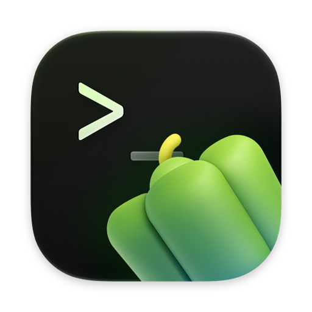
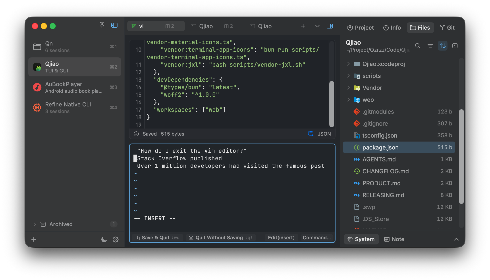

<p align="center">
  
</p>

<h1 align="center">Qjiao</h1>

<p align="center">
  <strong>青椒终端</strong> · 面向新手的终端工作区<br>
  终端、Agent、文件管理、代码编辑与运行、Git、图片处理<br>
  原生 · 免费 · 开源
</p>

<p align="center">
  <a href="https://qzrzz.com/Qjiao">官网</a> ·
  <a href="https://github.com/qzrzz/Qjiao/releases/latest">下载</a> ·
  <a href="https://kero.sh">Kero</a> ·
  <a href="./LICENSE">GPLv3</a>
</p>

<p align="center">
  
</p>

围绕项目文件夹的 macOS 原生终端工作区。基于 [Kero](https://kero.sh) 二次开发，按自己的使用习惯扩展。

**目录**：[下载](#下载) · [开发](#开发) · [仓库结构](#仓库结构) · [技术架构](#技术架构) · [FAQ](#faq) · [增加功能](#增加功能) · [上游移植](#上游移植记录)

## 下载

- 官网：[https://qzrzz.com/Qjiao](https://qzrzz.com/Qjiao)
- GitHub Releases：[最新安装包](https://github.com/qzrzz/Qjiao/releases/latest)
- 应用内 Sparkle 订阅：`https://download.qzrzz.com/qjiao/appcast.xml`

发布走本机签名与公证，经 QRls 上传到 Cloudflare R2。流程见 [RELEASING.md](./RELEASING.md)。

## 开发

本仓库是 monorepo。应用本体是 Swift / Xcode；脚本与官网用 **bun** + **TypeScript 6**。

```sh
bun install
bun run dev      # Debug 编译并在前台运行
bun run debug    # Debug 单窗口（可加 --record / --gui / --heap）
bun run web:dev  # 官网本地预览
```

需要本机已安装 bun，以及 Xcode（当前开发环境为 `Xcode-beta.app`）。

| 脚本 | 作用 |
| --- | --- |
| `bun run dev` | 编译 Debug 并前台跑二进制，输出日志与崩溃栈 |
| `bun run debug` | 单进程、单窗口测试；`--record` Time Profiler，`--gui` Instruments，`--heap` 堆分析 |
| `bun run version+` | 升版本号，并由 AI 写入 `CHANGELOG.md` |
| `bun run release` | 签名、公证、打包、发布 |
| `bun run web:build` | 用 QPage 生成静态官网到 `docs/` |

## 仓库结构

```text
kero/                 应用源码（历史目录名，来自 Kero）
Qjiao.xcodeproj/      Xcode 工程
scripts/              bun 脚本：dev / debug / release / changelog
web/                  QPage 官网源（i18n、资源、下载清单）
docs/                 官网构建产物
Vendor/               libghostty、STTextView、TreeSitter
icon/                 App 图标
CHANGELOG.md          应用内更新说明的源
RELEASING.md          本机发布流程
```

项目配置落在 `~/.config/qjiao/`（Debug 为 `qjiao-dev`），与正式版互不覆盖。

## 技术架构

| 层 | 选型 |
| --- | --- |
| UI | SwiftUI + AppKit，递归分屏与项目侧栏 |
| 终端 | Ghostty（`Vendor/libghostty-spm`），`TERM_PROGRAM=ghostty` |
| 编辑器 | STTextView + Tree-sitter 语法高亮 |
| 浏览器 / Diff | WKWebView、Pierre Diffs |
| 图片 | 内置 `oxipng` / `cwebp` / `cjxl` 等，Image Build 导出 |
| 脚本 | bun + TypeScript 6（`scripts/`） |
| 官网 | QPage → `docs/`，多语言静态页 |
| 发布 | QRls → Cloudflare R2，Sparkle 自动更新 |
| 文案 | `L10n.t`，英文为 key；`zh-Hans` / `ja` |

二次开发增量见下方「增加功能」；从上游 [Kero](https://github.com/egoist/kero) 移植时不带 git 记录，对照基线写在「上游移植记录」。

## FAQ

**为什么比 Kero 体积大？**

内置了中文等宽字体（`SourceHanSansCN-VF-Mono1200.ttf`、`InterVariable.ttf`），以及 `cwebp`、`oxipng`、`cjxl` 等图片处理工具。

## LICENSE

[GPLv3](./LICENSE)

## 增加功能

相对上游 [Kero](https://github.com/egoist/kero) 的二次开发增量。按能力域归纳；细节以源码为准，此处只写**用户意图**。

### 项目与工作区

- 以项目文件夹为中心：侧栏管理多项目，支持描述、自定义图标（预置 / Emoji / SF Symbols / 本地文件，支持根据周围透明像素一键剪裁紧凑图标）、归档与搜索（点击已归档项目仅激活查看，不自动取消归档，可通过 hover 图标或右键显式取消）。
- 侧栏底部以分组 tabs 取代原先的已归档折叠区：默认「个人 / 工作 / 当前 / 已归档」；未显式分配分组的项目（含历史旧项目）默认归入「个人」；「当前」只列出仍有标签页的未归档项目，个人与工作为可归属分组，可新建自定义分组；右键或拖到 tab 上移动项目。
- 新建项目走系统文件夹选择器（可新建目录）；支持 Finder 拖入、侧栏拖入、空状态拖入、Finder 服务「Open in Qjiao」、以及 `qjiao [path]` CLI。
- 项目配置落在 `~/.config/qjiao/projects/{id}/`（Debug 为 `qjiao-dev`），会话快照在 `session.json`，与 Dev/正式版互不覆盖；关闭项目清理对应目录。
- 左侧：窗口置顶、侧栏开关（⌘B）、一键打开文件夹、批量 AI 整理 / 归档 / 清理空项目。点击项目先响应侧栏选中态，内容区、主题与右侧栏下一拍再跟进，避免终端挂载卡住点击反馈；当前打开项目使用 macOS 27 Liquid Glass 选中态并带有点击动态效果与淡投影，非强调玻璃按模式统一使用深色黑色 6%、明亮白色 6% tint。
- 「使用自动标题」为独立开关，可与自定义项目名并存。
- 命令面板可搜索并打开当前项目文件（遵守 Git ignore / 常见构建产物忽略）。

### 终端与分屏

- 递归分屏树：任意方向嵌套；标签可拖入内容区边缘分屏；任务「重新运行」优先在原 pane 替换会话，不打散分屏布局。
- 终端 ⌘R 重新运行：脚本/运行器创建的终端（右侧栏任务、npm scripts、Script Runner 单文件脚本等）按 ⌘R 在其原 pane 原地重新运行；普通 shell 会话不拦截，⌘R 仍放行给菜单（浏览器 Reload）或终端。
- 标签布局可选弹性压缩（默认）、横向滚动或多层换行（宽度 < 320pt 时为 1 列，>= 320pt 时最少 2 列并自动均分填满容器、最多 3 行，再多则在 3 行视口内纵向滚动并上下渐隐；多行模式下当标签行数大于 1 行时右侧操作按钮由上至下垂直排列：侧栏/下拉/新建/退出缩放，单行时保持水平排布）；在 Tabs 空白处右键可切换布局；Ctrl+1–9 切标签；Ctrl-Tab 预览（可选 MRU）；溢出滚动时选中 Tab 自动避让边缘渐隐，不被遮挡；右键可「关闭全部文件 / 关闭全部 Diff / 关闭空标签」（从未用过的终端与空白浏览器）。
- Ctrl-Tab 切换器在窗口失焦或应用退到后台时安全取消，避免主线程回调隔离检查导致偶发崩溃。
- 长时间运行后界面卡顿：display cycle 防护不再每次窗口布局都符号化调用栈，并把同一轮刷帧的布局请求按窗口合并；文件树拖拽结束的全局鼠标监听只注册一次。
- 内容 Tabs 拖拽排序采用 Chrome 风格水平浮动预览：源 Tab 仅跟随鼠标横向移动，周围 Tab 以短响应弹簧动画让位，按相邻 Tab 中线触发换序，拖拽时屏蔽其他 Tab 的 hover 状态，标题、图标与选中底色保持同步；关闭按钮仅在当前 Tab hover 时显示，分栏标识在 Tab 右侧水平排列、垂直居中并保留 2pt 右边距，关闭按钮出现时快速过渡；拖拽期间锁定每个 Tab 的宽度，结束后再按最终顺序重算，避免宽度变化导致抖动；浮层带材质模糊底板，避免内容透底。非当前 Tab 拖过 Tabs 底部 20pt 后进入分屏拖拽模式，浮层改为二维跟随鼠标。
- 终端默认点击移动光标、OSC 133 语义提示符；闲时标签标题可配置；可开关 Option-as-Alt、Vim 帮助条、字体加粗。
- 主内容区当前 Tab 使用 macOS 27 Liquid Glass 选中态，并带有点击/悬停动态反馈；非当前 Tab 保持轻量平面样式。
- 粘贴安全确认（OSC 52 / 可疑内容）；Finder 文件粘贴为 shell 路径；`TERM_PROGRAM=ghostty`，不强制注入 `LANG`。
- 终端桌面通知带声音；点击通知自动激活窗口并跳转到发出通知的会话。
- 兼容用户安装的 ghost-complete 等 PTY 补全代理；前台进程驱动 Tab 应用图标（含深浅色变体）。
- 终端本地文件链接：⌘-点击链接时本地文件在 Finder 中显示、URL 走浏览器；⌘-右键文件链接可在 Qjiao 中新建文件标签/分屏打开（路径按 pane 工作目录解析，支持 `~`、`file:` 与 `:行:列` 后缀）。
- 多 Tab 惰性启动 Shell，后台 Tab 降低 GPU 占用；访问过的项目其 Diff 视图保持挂载，切换项目不重建 WebKit（提速），恢复会话时保留文件/Diff 标签的上下文终端指向。
- 退出后再启动时，工作目录已不存在、进程无法拉起、或恢复出来只会是空 shell 的终端不再落到家目录、也不留下 “Process exited” 死标签，直接关闭（分屏塌缩，空标签丢弃）；从未用过、没有可回放历史的终端也不会写入会话快照。

### Git

- 非 Git 目录探测在文件系统根目录正确终止，避免损坏 `.git` 元数据或普通目录触发无限路径遍历。
- **操作逻辑可配置（简单 vs 传统）**：设置中新增 Git 分类与操作逻辑切换，默认使用简单模式（GitHub Desktop 风格，统一 CHANGES 单列表 + 复选框提交，点击提交按钮批量打包暂存并 commit；传统模式保持 VS Code 已暂存/变更分立列表）。
- 事件驱动刷新（仓库元数据 + 工作区监听）加低频心跳兜底，替代固定短间隔轮询；切换仓库时保留旧内容直至新结果就绪，减少闪烁；两仓库来回切换时立即恢复上次解析的内容（单槽快照），不再显示上一个仓库的旧状态。
- **刷新分级提速**：工作区文件事件 / 终端命令完成 / cd / 切换标签等高频路径只跑 rev-parse + status 快路径（3 个子进程），提交历史、分支、remote、stash 等详情（含大仓库上比 status 更贵的 `git log --name-status`）由 HEAD/refs 元数据事件（commit/checkout/branch 才会触发）、提交历史展开时按需加载与低频心跳补齐；快路径期间 UI 保留旧详情展示不闪烁。10s 定时不再与内部心跳重复全量扫（root 未变时跳过），Git 标签页外的事件刷新不再带详情。
- Git 操作进度反馈：更多操作菜单（Fetch/Pull/Push/Stash 等）、分支切换、提交选项菜单、初始化仓库按钮均有进行中指示；发起新操作自动折叠上一条操作输出。
- trackingBar 加高；待 push 数量徽章改为强调色按钮，点击执行 Push。
- **分叉分支拉取**：`git pull --ff-only`（含 Sync）因本地与远程分叉失败时，操作横幅提供「变基拉取」按钮（`git pull --rebase`）；更多操作菜单也可主动选择 Pull (Rebase)。
- **操作中切换项目立刻跟新**：root 变化时脱离旧 commit/stage 的 `isBusy`，高优先级扫描新仓库，Git 面板不再等旧操作跑完才切换。
- **Commit Staged 加速**：操作前 HEAD/branch 校验改为轻量 `rev-parse`（不再全量 `git status`）；mutation 后先快路径更新变更列表（跳过 log/stash 等详情，空闲再补全）；全量扫描详情命令并行。
- **修复无提交仓库首次 Commit 误拒**：unborn 分支上 `rev-parse --abbrev-ref HEAD` 失败，操作前 HEAD 稳定性校验误报「Branch or HEAD changed」；改为 `symbolic-ref --short HEAD` 读取分支名，与 porcelain `# branch.head` 对齐。
- **对齐 VS Code 的乐观更新与刷新策略**：
  - Stage / Unstage / Stage All / Unstage All / Commit：git 子进程跑之前先改 UI 列表（失败回滚快照），列表几乎瞬时响应；后台再轻量 `status` 纠偏。
  - 文件事件：操作中 / 失焦 / 大仓库（status 上限）跳过自动扫；1s 防抖合并；mutation 后 5s 冷却避免 index 自触发扫。
  - Stage 类操作跳过 HEAD 稳定校验（与 VS Code 一样只跑 `git add`/`restore`）。
- 大仓库友好：变更上限、未跟踪目录折叠展示、列表惰性渲染；可指定项目级 Git 仓库路径。
- 提交历史：可展开查看每次提交改动的文件列表（点击打开父→提交的历史 diff），支持分页加载更多；提交图（垂直线 + 圆点）、引用徽章（HEAD/main/tag）、滚动接近底部自动加载更多。
- 提交历史分组统一命名为「提交历史」；创建 commit 或 amend 成功后立即刷新真实提交记录。
- 提交历史列表样式优化：时间线左移并保证圆点与竖线对齐；branch / tag 引用徽章靠右对齐且宽度按内容自适应，最大化提交标题显示空间。
- Commit 输入框使用单个多行编辑器，第一行作为 Subject、后续内容作为 Body；提交时按 Git 标准用空行拼接。
- stage / commit / discard、历史提交编辑（Reword / Amend / Drop 等）、大 Diff 虚拟化渲染；右侧 Git 标签显示变更数角标。
- 多语言（L10n）完整覆盖 Git 操作完成提示（Commit/Push/Pull/Fetch/Stage/Discard/Stash 等状态与输出消息），支持中文与日文实时切换。
- 扫描失败可强制刷新并自愈 fsmonitor；子进程统一超时与回收，彻底治理 Process / Pipe 文件描述符 (FD) 泄漏（显式关闭 stdin/stdout/stderr 读写句柄，Diff 视图统一下放 SubprocessRunner），解决长时间运行后因 FD 耗尽引发 `Bad file descriptor` (`NSPOSIXErrorDomain` code 9) 导致子进程创建失败的问题。
- 修复 Ghostty 屏幕导出的目录 fd 泄漏：终端预览 / Agent 读屏改为 `ghostty_surface_read_text` 直接读 surface；FD 巡检监控扩展到 release，rlimit 软上限最多提升至 65536。
- 将嵌入式 Ghostty 从锁定提交 `35e1a016…` 更新到 [tip](https://github.com/ghostty-org/ghostty/releases/tag/tip) `b69f612`（2026-08-26）。上游已修好 TempDir 导出 fd 泄漏，因此去掉 `0011-fix-tempdir-fd-leak.patch`；剪贴板回调对齐新的 `ghostty_clipboard_complete_s` / `ghostty_surface_deny_clipboard_request` API。
- Files 树可选 Git 状态装饰（默认关）。

### 文件、编辑与图片

- Files / CWD：Material 图标、多选、拖拽移动、复制粘贴（与 Finder 互通）、排序、按需算目录体积、右键「在终端打开」等；刷新与 Files ↔ CWD 切换保留已展开文件夹与滚动位置；package.json 右键可直接运行 npm scripts。
- 全局文本搜索（内置 ripgrep，可降级 Swift 扫描）：大小写 / 全字 / 正则、包含排除、替换。
- 源码编辑器：语法高亮、查找、底部状态栏与 oxfmt/prettier 格式化；编辑器可独立 Light/Dark 主题；复制/粘贴强制纯文本，语法高亮只叠加渲染色不污染文本存储，避免异常样式影响输入与复制。修复刚打开文件时语法高亮不显示（颜色已写入渲染属性但未触发视口重绘；query 异步编译期间不再把首屏标成已高亮）；打开文件时预编译 tree-sitter 查询，视口就绪后再铺色。
- 文件自动保存（对齐 VS Code `files.autoSave`）：关闭 / 延迟后 / 编辑器失焦时 / 窗口失焦时；延迟默认 1000ms。设置 → 编辑器、文件菜单「Auto Save」，或编辑器底栏保存状态按钮（立即保存 / 勾选自动保存）。开启自动保存且已落盘时底栏显示「已自动保存」。
- Markdown 预览：`.md` / `.markdown` 等文件可在底部状态栏切换左右分栏（源码 | 实时预览），分割比例可拖；预览跟随编辑器主题，支持标题、列表、任务、表格、代码块、图片与链接。左右滚动按源码块对齐（标题/段落/列表等），而不是跟像素位置硬同步。外部工具改写 Markdown 后编辑器与预览一并刷新。Markdown 默认自动换行（与其它源码的全局换行开关分开）。
- Markdown 插图：⌘V 粘贴图片或把图片文件拖进编辑器，写入 Markdown 同级 `assets/` 并插入 ``；来源已在 `./assets` 内则直接复用，不复制。
- 二进制 Hex 编辑器：Hex/ASCII 编辑、通配查找替换、跳转偏移、外部变更冲突处理。
- 单文件 Script Runner（Run / Run with…）与底栏运行/停止分屏。
- 图片查看器：缩放平移、标尺参考线、双图对比、背景模式；SVG 上下分屏代码+预览。
- **Image Build**：缩放与转 PNG / JPG / WebP / JXL（内置 oxipng、cwebp、cjxl 等）；支持 Suffix（添加后缀）与 File Name（重命名）两种导出命名模式，预置 10 种尺寸全套 macOS Icon 图标模板。
- 内置浏览器 Tab/分屏（WKWebView）：地址栏、前进后退、快照恢复标题与 favicon；使用新版 Safari User-Agent，修复 B 站等站点识别为旧浏览器的问题。

### 右侧栏

- 上半：Project / Files / CWD / Git / Info；下半：System / Tasks / Note（可收起，分割比例可调）。
- 顶部面板 Tabs 与 Project 的代码编辑器 / AI 工具打开按钮使用 macOS 27 液态玻璃；Tabs 整组共享玻璃材质，当前项保持清晰的选中填充，并在窄栏中自动收缩标签。
- 无打开会话时的「新建会话」主操作使用强调色液态玻璃，保留快捷键与原有行为。
- **Project**：路径、Launchers（终端 / 应用 / Finder / 网页 / Agent CLI）、npm scripts 与 Gradle / Just / Cargo / CMake / Makefile 任务、PACKAGE（版本与常用包管理命令）、进程与端口；包管理器可自动识别。
- **Info**：当前会话 CWD 下的同类信息；跟随 Agent worktree。
- **Tasks**：项目根目录下的 npm scripts 与 Gradle / Just / Cargo / CMake / Makefile 任务，可在查看 Files / Git 时直接运行。
- **System**：CPU / 内存 / 磁盘 / 网络 / 代理 / 可达性等（原生 API 为主，降低 CLI 轮询开销）；Note 按项目自动保存。
- 空脚本/任务分组自动隐藏；侧栏字号统一可调；窄宽度自适应布局。

### AI 与 Agent

- 统一 LocalAI：本地 CLI（grok / codex / claude / agy / opencode / pi）或云端 API（OpenAI / DeepSeek / Anthropic / Gemini / OpenRouter / xAI / 兼容端点）；Key 存 Keychain。
- **AI API 配置独立记录机制**：每个供应商各自的 Model、Base URL 与 API Key 独立保存与复用，切换供应商时自动恢复上一次的自定义参数，无需重复输入。
- **全链路 CLI 探测与环境增强**：全面覆盖 npm、pnpm（`~/Library/pnpm` 等）、yarn、bun、nvm（多版本动态扫描）、fnm、volta、asdf、mise 等包管理器的全局 bin 目录及用户登录 Shell PATH，解决从 macOS GUI 启动时无法检测到 pi / codex / claude / opencode 等 CLI 工具以及子进程缺失 node / npm 运行环境的问题。
- 能力：AI 选图标、AI 生成名称/描述/图标、AI Commit Message（语言与 Gitmoji 可配；上下文优先 staged；未跟踪文件仅提供文件路径，不读取正文）。
- AgentWatcher：识别常见 Coding Agent 的 working / blocked / done，Tab 绿点、未读蓝点与项目角标；可配完成/阻塞音效。
- Agent guarded pane：通过带终端 capability 的本地自动化协议查询/分屏/读写 Pane；Agent Prompt 仅发送给当前项目中仍在运行且未处于 blocked 状态的已识别 Agent，避免把自动输入注入错误终端。
- Project / Info 可一键用已安装的 AI 桌面应用或 CLI 打开当前目录。

### 外观与国际化

- 跟随系统语言，支持 English / 简体中文 / 日本語；界面文案走 L10n。
- Ghostty 全局与项目级 Light/Dark 配色；自定义主题（背景 / 文本 / 强调 + 终端 palette）。
- Project 面板 PACKAGE 图标在 Light/Dark 外观切换时可靠刷新，并正确应用对应的图标变体与主题色。
- 窗口与终端背景透明度、侧栏与文件树字体、短路径 `~`（默认开）、等宽中文字体回退；移除未打开会话与空状态界面的多余实色背景，透出全局窗口背景与毛玻璃材质。
- 优化设置分类导航的排列顺序为：通用、AI、终端、编辑器、项目、文件、Git、关于。
- 优化 Tab 分栏提示的文字与图标垂直居中对齐，并在未显示关闭按钮时紧靠标题左对齐。
- 音效：任务成功/失败、Agent 完成/阻塞（系统 / WinXP / Win7 方案可选）。

### 工程与发布

- 开发构建脚本固定使用 `Package.resolved`、Apple Silicon destination，并默认收起 Xcode 的 target 图与资源处理日志；`bun run dev` 在 app 已覆盖全部工程输入时直接启动，`QJIAO_FORCE_BUILD=1 bun run dev` 可强制重建。依赖更新后可手动执行 `xcodebuild -resolvePackageDependencies -project Qjiao.xcodeproj -scheme Qjiao -derivedDataPath build/DerivedData` 刷新缓存。
- 独立产品标识与 Sparkle 自动更新；本机 Developer ID 签名、公证、DMG/ZIP、delta，经 QRls 发布到 Cloudflare R2（订阅 `https://download.qzrzz.com/qjiao/appcast.xml`），并镜像同一份 appcast 到 GitHub 供旧版升级。
- 产品官网 `web/` 使用 QPage 生成静态着陆页，支持简体中文、English、日本語、한국어、Tiếng Việt、Português、Español、Deutsch、Français、Русский；移动端通过 `web/style.css` 收回桌面固定标题/页宽/视频尺寸，避免窄屏撑破。
- `version+` 脚本由 `scripts/update-changelog.ts` 调用 pi AI 生成版本更新记录并写入 CHANGELOG.md（与 pbxproj 中的 MARKETING_VERSION 严格一致）。
- 安装包清单由 QRls 写入 R2 的 `download.json`（版本、构建号、DMG/ZIP 直链、大小与 SHA-256）；官网通过 `downloadBase` 读取，不再由发布脚本写回仓库。
- `debug` 本机测试构建（`npm run debug` / `bun run debug`）：编译 Debug 版并以单进程、单窗口启动；`--record` 用 xctrace Time Profiler 追踪（启动 `.app`，避免内部二进制与 Launch Services 双开），`--gui` 打开匹配版本的 Instruments，`--heap` 启用 `MallocStackLogging` 做堆内存/泄漏分析。

## 上游移植记录

- 移植上游 Kero `main` `0590f15` + `0158396`（2026-08-11）：修复 Git 非仓库元数据探测在文件系统根目录可能无限循环的问题；修复 Ctrl-Tab 窗口/应用失焦通知回调使用 `MainActor.assumeIsolated` 导致的偶发崩溃。Qjiao 仅在结构上确定运行于主线程的 TabSwitcher 通知回调使用 `assumeMainActor`，未全局替换其他隔离调用。
- 移植上游 Kero `main` `4433b6f`（Add guarded pane and agent automation，2026-08-11）：适配 Qjiao 的 Ghostty 与 `AgentWatcher`，新增每终端 capability、本地 Unix socket/NDJSON 自动化协议及 `qjiao +pane` / `qjiao +agent` CLI；支持当前项目内 Pane 查询、分屏、读写、Agent 启动、状态等待和 guarded Prompt。未移植上游 Alacritty 专属改动、Agent Skill 安装以及独立的 Agent 状态扫描器；Blocked 拦截复用本地 `AgentWatcher` 结果，普通 `+pane send` 保留为明确的原始输入逃生通道。
- 移植上游 Kero `main` `b83f338`（Support terminal links to local files，v0.1.43，2026-08-04）：新增 `TerminalLinkTarget`（url/file）分类与 `TerminalSession.terminalLinkTarget(for:)`/`existingFileURL` 路径解析（file: URL、~ 展开、相对路径按 pane 工作目录、剥离 `:行:列` 后缀）；`terminalDidRequestOpenURL` 本地文件改走 Finder 显示；⌘-右键菜单新增「New File Tab / New File Pane」（SplitMenuTarget 经 representedObject 传递路径），回调链 KeroTerminalView → TerminalHostView → PaneLayoutView → ContentView（manager.openFile / openFileToSide）；L10n 三语词条。适配：本地 KeroTerminalView 无上游 `events` 代理，改为 `resolveLinkTarget` 回调由 TerminalSession 注入；保留本地 `kind: TerminalOpenURLKind` 参数与历史导出 URL 定制；上游 FileViewer/SourceTextEditor 移除 onNewBrowserTab 属重构清理，未跟随。`e74f2b0`（OSC 22 鼠标指针，Alacritty）未移植。
- 补全上游 `212ea0a` Recent Commits 视图的剩余 UI 差距（SwiftUI 实现，保留本地 GitCommitRow 定制）：提交图（`CommitGraphColumn` 垂直线 + 圆点，展开放大，首行/续线规则与上游一致；`FileRailColumn` 文件行延续线）、引用徽章（`primaryReference` 同上游规则：优先带斜杠分支、其次 HEAD 指向，accent 胶囊白字）、滚动自动加载（`LazyVStack` 中 Load More 按钮 `.task(id: commits.count)` 进入视口即加载，连续加载至填满或没有更多）。未跟随：AppKit 绘制（保持 SwiftUI）。
- 移植上游 Kero `main` `db9a061` + `0a253ba`（v0.1.40–v0.1.41，2026-08-04）：`DiffViewPreferences` 从静态 enum 重构为 `@MainActor ObservableObject` 单例（`@Published diffStyle`/`prefersEditing` 落盘 UserDefaults，多标签/多窗口同步编辑与布局偏好；`DiffWebModel.isEditing` 改为 `canEdit`，编辑意图统一读偏好）；diff 外观跟随系统主题——`DiffWebHostingView`（NSHostingView 子类）在 `viewDidChangeEffectiveAppearance` 时经 `DiffWebModel.usesDarkAppearance` 驱动 WebKit 的 `colorScheme` 环境值，`DiffControlsNSView` 颜色改为 `effectiveAppearance.performAsCurrentDrawingAppearance` 内更新。
- 上游 `93b2b34`（Support dragging tabs into split panes，v0.1.42）**无需移植**：对比确认本地 `TabSplitDragController` + `Project.mergeTab` 已实现等价能力（拖标签到任意 pane 四象限分屏、保留源标签完整分屏树 `absorb`、diff 标签不可并入、不能拖到自身终端），且本地另有光标反馈与落点预览。唯一缺口：上游在 `moveTab` 中把源标签的 `contextSession` 迁移给目标标签（目标为空时），本地 `mergeTab` 未处理——已按上游语义补齐。
- 移植上游 Kero `main` `212ea0a`（Improve the Recent Commits view in git panel，2026-08-04）：提交历史支持展开显示文件变更列表（`--name-status -z` + `--decorate=short` 单命令解析，RecentCommit 增加 `parentHash`/`references`/`files`）、分页加载（每页 8 条、`loadMoreCommits`、按 root 记忆分页位置）、打开历史提交 diff（`openCommitDiff`：父→提交比较，DiffTab 增加 `commitHash`/`commitParentHash`/`commitStatus`，会话快照新增 `commitDiff` 兼容解码）。本地保留 SwiftUI `GitCommitRow`（含 Reword/Amend/Drop/AI Commit 定制）并叠加展开与分页，未跟随上游 AppKit `RecentCommitsView` 重写；未移植上游 `runGit` timeout 参数（本地已统一 SubprocessRunner 超时）。
- 移植上游 Kero `main` `17bb787` + `dd14529`（Enable direct editing for live worktree diffs，2026-08-04）：PierreDiffsSwift 1.4.1 → 1.5.0；DiffWebModel 增加 fileID/编辑状态/编辑回调，DiffTab 增加 `isEditable`/`isDirty`/`saveError` 编辑状态机（`save`/`updateEditedContent`/`completeEditing`/`setDiffStyle`/`setEditing`，符号链接与 staged diff 不可编辑），`DiffViewPreferences` 记忆布局与编辑偏好；controlBar 替换为 AppKit `DiffControlsBar`（Review/Edit + Unified/Split，L10n 适配，新增 Split Layout 专用词条避免与分屏语义冲突）；关闭未保存确认泛化为 PaneContent（支持 diff），Tab 标签显示 dirty 标记。未移植：上游 `runGit` 的 timeout 参数与 10s 全局 deadline（本地已统一走 SubprocessRunner 超时/回收）。
- 移植上游 Kero `main` `3f0cdd8`（add toolbar）的 GitStatusModel 增量（2026-08-04）：`defaultBranch` 采用优化实现——`for-each-ref --format="%(refname:short) %(symref)" refs/remotes` 单命令并行解析所有 remote 的 symbolic HEAD（origin 优先），非 clone 仓库按 main > master 惯例降级，均校验必须存在于本地分支列表；替代上游串行 `symbolic-ref` 实现。`cachedStatusByRoot` 未直接移植，改为单槽 root 快照优化本地 `isSwitchingRoot`：`apply` 时保存最近一次成功解析结果，`sync(root:)` 切回同一 root 时立即 `apply` 恢复正确内容（不锁交互、后台刷新纠偏），多 root 循环退化为原路径。未移植：`lineAdditions`/`lineDeletions`/numstat 行数统计与未跟踪行数计数（用户不需要）、底部工具栏 UI 与 `toolbarVisibility` 设置（与本地右侧栏 Git 面板重叠）、`defaultBranch` 目前无 UI 消费方。
- 移植上游 Kero `main` `dae03e9`（Improve Git operation progress and error feedback，2026-08-04）的增量部分：本地已有同构的 `GitActionTarget` + `beginGitAction` 机制（覆盖 stage/unstage/discard/commit/sync），本轮补充更多菜单、分支菜单、提交选项菜单与初始化仓库的 spinner 触发源，`beginGitAction` 发起新操作时折叠旧操作输出，主操作按钮 accessibility 进度标签（L10n 三语）；保留本地全状态操作横幅（running/succeeded/failed）与内联分支创建输入框，未跟随上游失败横幅与 NSAlert 改造。
- 本轮移植上游 Kero `main` `90cd6bf` 之前的 unrelease 提交（2026-08-04，`2163068` 之后）：
  - `90cd6bf` 选中 Tab 滚动避让边缘渐隐：适配本地弹性布局（保留无动画滚动策略与 chrome 抢先选中），新增 `StripGeometry.contentOffsetX` 与 fade-aware 滚动算法。
  - `1da3345` 访问过的项目 Diff 保持挂载（切换提速）：`webHostView` 改为可选并延迟 materialize、`retainedDiffProjectIDs` 保留集合、`TabSnapshot` 新增 `contextSessionIndex`（含旧快照兼容解码）与 `restoreTab` 返回 `PaneTab?`；上游新增的 AppKit 加载骨架 `DiffControlsSkeletonBar` 未移植（本地 controlBar 为 SwiftUI 轻量版，维持基线视觉）。
  - `9ea40a6` + `31d09ed` 通知点击跳转会话与通知声音：重写 `TerminalNotificationService`（settings 重构 + sound 升级授权 + userInfo 携带 sessionID），`TerminalManager` 新增静态 `revealSession(id:)`；保留本地 Qjiao 标题。
  - `567ab96` 浏览器 Safari User-Agent；`628dee2` 标签右键「关闭全部文件 / 关闭全部 Diff」（L10n 三语词条）。`8d4b0f2`（新终端优先钉住的项目目录）已回退：上游 `customDirectory` 默认 nil、仅显式钉住时非空，而 Qjiao 的 `projectDirectory` 在项目创建时自动填充（所有项目都有值），移植会改变所有项目的新终端默认目录，故恢复原有「跟随当前会话目录」行为。
  - 未移植：`01566f9`（QoS 修复针对上游 Thread 读取实现，本地已统一走 `SubprocessRunner`）、`ac4ca58` / `db0da69`（Alacritty 后端相关）。
- 移植上游 Kero `main` commit [`e08729b`](https://github.com/egoist/kero/commit/e08729bb19dd54d9355f269851209e96f7c0905f)（Files 面板 Git 状态装饰，v0.1.35 之后 unrelease）：适配 Qjiao 的 `GitStatusModel`（`Character` 状态位）、`FileTreeRow` 定制与 `L10n` 三语词表，并按要求默认关闭、在 `Settings → Files` 新增 `files.git-decorations` 开关。
- 移植上游 Kero `main` commit [`2163068`](https://github.com/egoist/kero/commit/216306845d24484600f3ac8e57c8191eb4f01bde)（Ctrl+1–9 切换标签）：主 Tab 快捷键由 `Ctrl+Shift+1–9` 改为 `Ctrl+1–9`；上游官网快捷键文案因 Qjiao 官网组件化重构无对应文案表，未跟随。
- 移植上游 Kero commit [`285fb66`](https://github.com/egoist/kero/commit/285fb6655b4d1284af62bb0b647b94c83849aeff)（Refine terminal workspace behavior，v0.1.35）：递归 split 树布局重构，覆盖 `Panes.swift`、`PaneLayoutView.swift`、`SessionStore.swift`、`TabSwitcher.swift`、`TerminalManager.swift` 与 `Project.swift`；保留本地定制（`materialFileName`、`isTaskRunning` / `taskHasError`、`showPaneHeaders` 开关、`onClosePane`、`TerminalHelpBar`、`Theme.cursor` 焦点色），会话快照兼容旧 column 与单内容格式并自动迁移。
- 本轮比对基线更新为 Kero `main` `2163068`（2026-07-31，含 `v0.1.35` 及两个 unrelease 提交）。未移植：`6b37b26`（Alacritty 渲染器修复，本地不包含该后端）；`2b9cd95` / `6dda01f` / `07f5589`（侧边栏行稳定与 Grok CLI 标题识别，本地 `SidebarView` 已重构且按要求不移植）。
- 最近完成比对与选择性移植的上游基线：Kero `main`（`058694c1e280237545f1cf4d6b14145b81e5b3cb`，包含 `v0.1.33`，2026-07-29）。
- 移植上游 commit [`fe9f622b6b55c087d5d6f449b0159d3f1e227766`](https://github.com/egoist/kero/commit/fe9f622b6b55c087d5d6f449b0159d3f1e227766)：“Add Open in Kero to Finder's folder context menu”，添加 Finder 右键文件夹服务菜单功能，在 Qjiao 中重命名为 “Open in Qjiao” 并适配项目生命周期与窗口接管。
- 移植上游 commit [`7bb18e6390ed4f883d15e6711460f88c36ea7d95`](https://github.com/egoist/kero/commit/7bb18e6390ed4f883d15e6711460f88c36ea7d95)、[`8c01a817d5fa085c9579f9569d9783ba38629bda`](https://github.com/egoist/kero/commit/8c01a817d5fa085c9579f9569d9783ba38629bda)、[`c79789b767e30901035471f8ef334b07a1666abf`](https://github.com/egoist/kero/commit/c79789b767e30901035471f8ef334b07a1666abf) 与 [`4d882462e840f4d1f5a0db1791d4165b1ebccbb5`](https://github.com/egoist/kero/commit/4d882462e840f4d1f5a0db1791d4165b1ebccbb5)：保持选中 Tab 可见、修复命令面板指针与 Escape 交互、在命令面板搜索项目文件，以及停止向终端注入 `LANG`；文件索引和文案已适配 Qjiao 的项目目录、忽略策略与 `L10n`。
- 移植上游 Kero `v0.1.32` commit [`46977b25d777c7fe98d32af016efd0274f6828c1`](https://github.com/egoist/kero/commit/46977b25d777c7fe98d32af016efd0274f6828c1)、[`c210d551c9d99dc085c5876c677845848f030d8f`](https://github.com/egoist/kero/commit/c210d551c9d99dc085c5876c677845848f030d8f) 与 [`d9d759c17a37a6d307cf9727d034bbd70053a5d8`](https://github.com/egoist/kero/commit/d9d759c17a37a6d307cf9727d034bbd70053a5d8) 的原生浏览器功能；最新比对基线仍为 Kero `main` `058694c1e280237545f1cf4d6b14145b81e5b3cb`（包含 `v0.1.33`，2026-07-29）。已适配 Qjiao 的 Pane、动态标题、URL 快照、主题、L10n、Ctrl-Tab 预览与 Ghostty 右键菜单，并明确排除所有 Alacritty 后端、bridge 与 Rust 代码。
- 本轮移植 Option/Meta 设置、隐藏渲染目标内存优化、外部图片变更刷新、侧栏字号和事件驱动 Git 刷新；不移植可选 Alacritty 后端。
- 已采用上游 `v0.1.24` 的兼容策略，将新建终端的 `TERM_PROGRAM` 设置为 `ghostty`。
